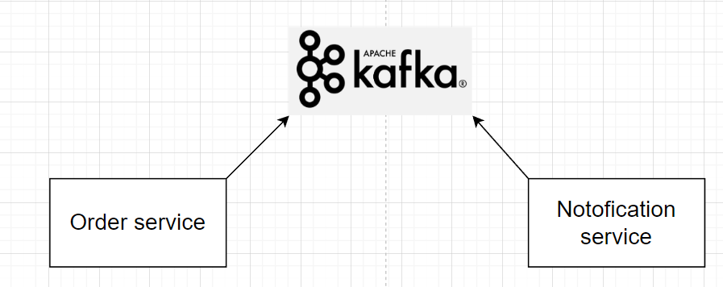

## TShopping project

### This is a simple microservice java project
### Project technologies:
- Spring Boot
- Spring Data JPA (MySQL)
- Spring Data MongoDB
- Spring Cloud (Gateway, Micrometer, Eureka)
- Spring Security (OAuth 2.0 with Keycloak)
- Zipkin (with micrometer to trace requests)

### Project structure

### Inter Service communication
#### Two approaches were used to communicate between services:
- Synchronous communication (WebClient direct http API calls)

- Asynchronous communication (Kafka message system)

### Data sources
#### For data storages two databases were used (MySQL and MongoDB)

### Security
#### This application was secured using OAuth 2.0 with Keycloack server
